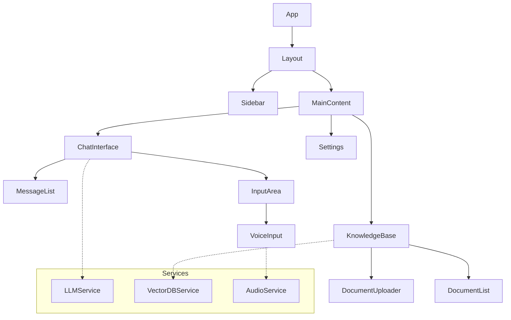

# Architecture & Tech Stack

## Overview
Qnexa AI is a **client-side first** application. It relies heavily on browser APIs and local execution to ensure privacy and performance. There is no proprietary backend server; the frontend communicates directly with LLM providers or local services.

## Technology Stack

### Frontend Core
-   **React 19**: The latest version of React for building the UI.
-   **TypeScript**: Ensures type safety and better developer experience.
-   **Vite**: Fast build tool and development server.

### AI & Machine Learning
-   **@xenova/transformers**: Runs transformer models (like embedding generation) directly in the browser using WebAssembly.
-   **Custom RAG Pipeline**: A hand-rolled Retrieval-Augmented Generation pipeline — no third-party framework. Handles chunking, embedding, vector retrieval, and prompt construction natively.
-   **Ollama Integration**: Direct REST API integration with local Ollama instances.

### Data Storage
-   **ChromaDB**: The primary vector database for semantic search.
-   **IndexedDB**: Used as a persistent storage layer for the vector database and large files.
-   **LocalStorage**: Stores lightweight configuration data (API keys, user preferences).

### Styling
-   **Vanilla CSS**: A custom, variable-based design system without heavy frameworks like Tailwind. This ensures a unique, "premium" look with glassmorphism effects.

## Component Hierarchy

## Data Flow

1.  **User Input**: User types or speaks a query.
2.  **Context Retrieval**:
    -   The app converts the query into a vector embedding (using `@xenova/transformers` or OpenAI/Gemini).
    -   It queries the local Vector DB for relevant document chunks.
3.  **Prompt Construction**:
    -   Retrieved context is appended to the user's prompt.
    -   System instructions are added.
4.  **LLM Inference**:
    -   The constructed prompt is sent to the selected provider (OpenAI, Gemini, or Ollama).
5.  **Response Streaming**:
    -   The LLM streams the response back token-by-token.
    -   Markdown is rendered in real-time.

## Security Model

-   **Zero-Knowledge Backend**: We do not host a backend that processes your data.
-   **Local Keys**: API keys never leave your device except to authenticate with the specific provider (e.g., OpenAI).
-   **Local Data**: Your knowledge base documents are processed and stored entirely within your browser (IndexedDB).
